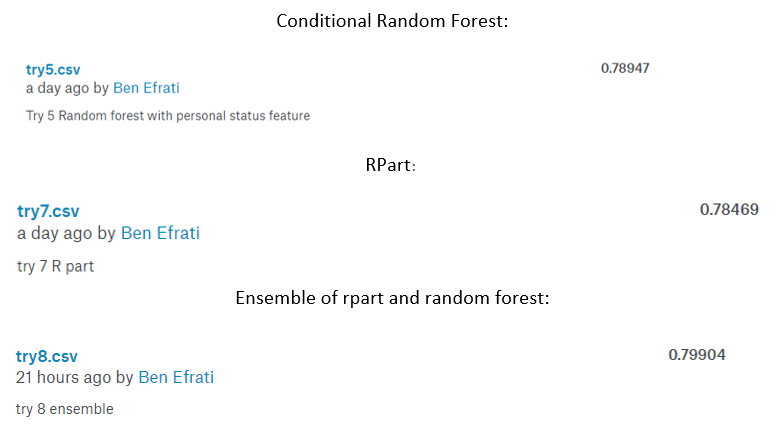
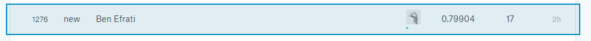

##Solution:

Set a folder as a working directory.

RScript:
```{r}
setwd('C:\\R\\Titanic')
```


rmarkdown:
```{r setup}
knitr::opts_knit$set(root.dir = 'C:/R/Titanic')
getwd()

```

Read the train.csv file into a dataframe.

```{r}
df <- read.csv("train.csv",na.strings = "")

```


```{r}
str(df)
```
###Preprocessing data
In this section we'll remove irrelevant columns, replacing NA values, feature engineering and normalize the data

Convert two features to factors.
```{r}
df$Survived<- as.factor(df$Survived)
df$Pclass<- as.factor(df$Pclass)
```

Ignore features like passengerId, name, cabin

```{r}
df <- df[,-c(1,4,9,11)]

```

```{r}
data <- df
```

Replace N/A Values with column mean
```{r}
for(i in 1:ncol(df)){
  if(is.numeric(df[,i])){
    df[is.na(df[,i]), i] <- mean(df[,i], na.rm = TRUE)
  }
}
#remove NA for non numeric data
df <- na.omit(df)
```


##Features Engineering
**BrothersStatus** - we thought that sibling and age might predict if the person will survive or not
**ChildrensStatus** - we thought that being a parent might predict if the person will survive or not
**PersonalStatus** - we thought that being alone and if age is greater than 20,  then it might predict if the person will survive or not
```{r}
df <- transform(df, BrothersStatus= Age*(SibSp))
df <- transform(df, ChildrensStatus= Age*(Parch))
df <- transform(df, PersonalStatus= ifelse(Parch==0, ifelse(Age>20,'Single','Not Single'),'Not Single'))
df$PersonalStatus<- as.factor(df$PersonalStatus)

```


divide the features' names to numerics and factors:

```{r}
cols<- 1:dim(df)[2]
factors <- cols[sapply(df,is.factor)]
numerics <- cols[!sapply(df,is.factor)]
```


We now tide the data two times: the first is for categorial data and the second for numeric data.

```{r}
#install.packages("tidyr")
library(tidyr)
df_tidy_factors<-gather(df[,factors],"feature","value",-1)
df_tidy_numerics<-gather(cbind(Survived=df[,1],df[,numerics]),"feature","value",-1)

```


Finally, we can plot. The first plot describes only categorical features (factors). 
Notice that the *scales* parameter was set to "free" to enable a suitable scaling for each facet (otherwise it is hard to view some of the facets, that need much smaller scales). We use the *facet_grid* that accepts a *scales* parameter.

```{r}
#install.packages("ggplot2")
library(ggplot2)
qplot(x=value,data=df_tidy_factors,fill=Survived) + facet_grid(~feature,scales="free")
```
As we can see there is difference in survival chance between single and not single.

One more plot for numeric features:
```{r}
qplot(x=value,data=df_tidy_numerics,fill=Survived) + facet_grid(~feature,scales="free")
```
As we can see, ChildrensStatus and BrotherStatus is an uninformative features. 


###Removing uninformative features
We trying testing with this features and found they low the accuracy of the model so we decided to remvoe them.
```{r}
df$BrothersStatus <- NULL
df$ChildrensStatus <- NULL
```


Split the data into 75% train and 25% test sets.

```{r}
indices <- sample(1:nrow(df),nrow(df)*0.75)
train<- df[indices,]
test<- df[-indices,]
```

##Random Forest
We tune the random forest model 
because the dataset size we chose lower parameter for ntree, we try different numbers but model didn't predict better.
```{r}
# install.packages('party')
library(party)
rfModel <- cforest(as.factor(Survived) ~ Pclass + Sex + Age + SibSp + Parch + Fare + Embarked + PersonalStatus,#+ BrothersStatus + ChildrensStatus,
                 data = df, 
                 controls=cforest_unbiased(ntree=10, mtry=3))
```

```{r}
PredictionRF <- predict(rfModel, test, OOB=TRUE, type = "response")
```

##C5.0

Train a C5.0 decision-tree model based on the train data.

```{r}
#install.packages(C50)
library(C50)
set.seed(123)
C50 <-C5.0(Survived ~., data=train )
```

```{r}
#plot(C50)
```


10. Predict the target feature for records of the test set, using the trained model.

```{r}
pred <- predict(C50,test)
```

###RPart

```{r}
#install.packages("rpart")
library(rpart)
rpartModel <- rpart(Survived ~.,
                   data=df,
                   na.action = na.pass,
                  control = rpart.control(maxdepth=3))

```


```{r}
#install.packages("caret")
library(caret)
set.seed(123)
control <- trainControl(method="cv", number=10)
fit.c50 <- train(Survived~., data=df, method="C5.0", metric="Accuracy", trControl=control,na.action = na.pass)
fit.c50
```


Load the test file. Don't forget the empty strings issue when loading the file (na.strings = "").

```{r}
new_df <-read.csv('test.csv',na.strings = "")
```

Create a vector with the PassengerIds of records in the test file. We will soon attach it to the prediction results.

```{r}
ids<- new_df$PassengerId
```


16. Repeat the same preprocessing steps that were performed on the train data (factorizing two features and ignoring three features). You must make sure that the train and test data have the same structure (except for the target feature)

```{r}
new_df$Pclass<- as.factor(new_df$Pclass)
new_df<- new_df[,-c(1,3,8,10)]
```


Replace N/A Values with column mean
```{r}
for(i in 1:ncol(new_df)){
  if(is.numeric(new_df[,i]))
    new_df[is.na(new_df[,i]), i] <- mean(new_df[,i], na.rm = TRUE)
}

new_df <- na.omit(new_df)
```

###Feature eng test set
```{r}
#new_df <- transform(new_df, BrothersStatus= Age*(SibSp))
#new_df <- transform(new_df, ChildrensStatus= Age*(Parch))
new_df <- transform(new_df, PersonalStatus= ifelse(Parch==0, ifelse(Age>20,'Single','Not Single'),'Not Single'))
new_df$PersonalStatus<- as.factor(new_df$PersonalStatus)

```

Load the test file and predict the target attribute for its records using your trained model. Don't forget to set *na.action* to "na.pass" if you used caret in the model creation, otherwise it will fail.

```{r}
new_pred<- predict(fit.c50,new_df,na.action = na.pass)
```

###RF
```{r}
PredictionRF <- predict(rfModel, new_df, OOB=TRUE, type = "response")
```

###Rpart
```{r}
PredictionRPart <- predict(rpartModel, new_df, OOB=TRUE, type = "class")
```

##Ensemble 
```{r}
#install.packages("caretEnsemble")
data <- df
data$Survived <- make.names(data$Survived)
library(caretEnsemble)
library(caret)
library(rpart)
library(party)
models <- caretList(
  Survived ~ .,
  data = data,
  trControl = trainControl(method="cv", 
                           number=10,
                           savePredictions='final',
                           index=createFolds(df$Survived,10),
                           #summaryFunction=twoClassSummary,
                          classProbs=TRUE
                           ),
  metric = "Accuracy",
  tuneList = list(
    rpart = caretModelSpec(
      method = "rpart"
    ),
    rf = caretModelSpec(
      method = "rf",
      tuneGrid = data.frame(
        .mtry = 8
      ),
      ntree=10
    )
  )
)
```

###predict ensemble

```{r}
library(caretEnsemble)
ens <- caretEnsemble(models)
data <- new_df
ens_predict <- predict(ens, newdata = data, OOB=TRUE)
```

19. Write the *PassengerId* and *Survived* attributes to a csv file and submit this file to kaggle's competition (You should first subscribe to the site). What is your score?

```{r}
res <- cbind(PassengerId=ids,Survived=as.character(ens_predict))
write.csv(res,file="try12.csv",row.names = F)

```


## Kaggle Scores




