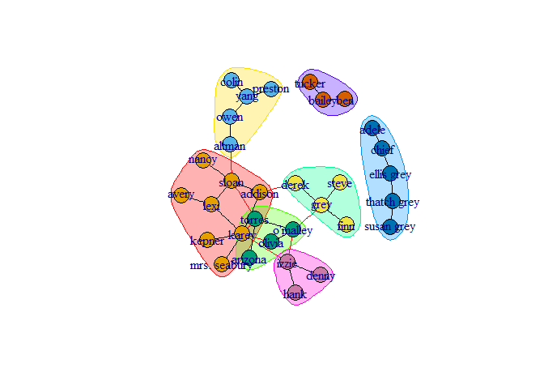
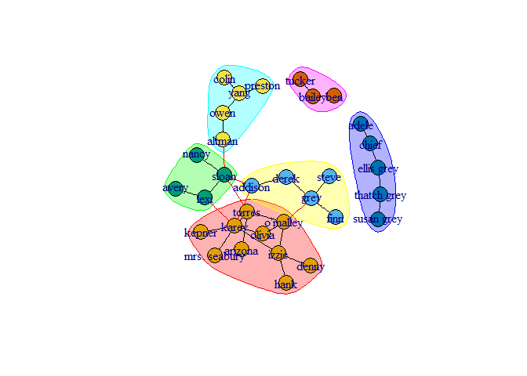

Exercise 3
================

Question 1
----------

``` r
setwd("C:\\Users\\Ben\\Documents\\R\\Ex3")
#install.packages("igraph")
```

Load the data and create the graph

``` r
ga.data <- read.csv('ga_edgelist.csv', header=TRUE, stringsAsFactors=FALSE)
ga.vrtx <- read.csv('ga_actors.csv', header=TRUE, stringsAsFactors=FALSE)
library(igraph)
```

    ## 
    ## Attaching package: 'igraph'

    ## The following objects are masked from 'package:stats':
    ## 
    ##     decompose, spectrum

    ## The following object is masked from 'package:base':
    ## 
    ##     union

``` r
g <- graph.data.frame(ga.data, directed = F)
```

Centrality
----------

### Compute betweenes

``` r
library(igraph)
between <- betweenness(g)
maxBetweenes <- which.max(between)
cat("The actor with the maximum betweenes is:\n")
```

    ## The actor with the maximum betweenes is:

``` r
maxBetweenes
```

    ## sloan 
    ##     3

### Compute Closeness

``` r
library(igraph)
close <- closeness(g)
maxCloseness <- which.max(close)
cat("The actor with the maximum closeness is:\n")
```

    ## The actor with the maximum closeness is:

``` r
maxCloseness
```

    ## torres 
    ##      4

### Compute Closeness

``` r
library(igraph)
eigen <- eigen_centrality(g, directed = F)
maxEigen <- which.max(eigen$vector)
cat("The actor with the maximum eigenvector is:\n")
```

    ## The actor with the maximum eigenvector is:

``` r
maxEigen
```

    ## karev 
    ##     6

Communities
-----------

### First algorithm

cluster\_edge\_betweenness performs this algorithm by calculating the edge betweenness of the graph, removing the edge with the highest edge betweenness score, then recalculating edge betweenness of the edges and again removing the one with the highest score, etc.

``` r
set.seed(123)
gc <- cluster_edge_betweenness(g,directed = F)
cat("Number of communities:\n")
```

    ## Number of communities:

``` r
cat(length(gc))
```

    ## 7

``` r
cat("\n")
```

``` r
cat("Size of communities:\n")
```

    ## Size of communities:

``` r
cat(sizes(gc))
```

    ## 8 5 4 4 5 3 3

``` r
cat("\n")
```

``` r
cat("Modularity is:\n")
```

    ## Modularity is:

``` r
cat(modularity(gc))
```

    ## 0.5774221

``` r
plot(gc,g)
```



### Second algorithm

cluster\_fast\_greedy

``` r
set.seed(123)
greedy <- cluster_fast_greedy(g)
cat("Number of communities:\n")
```

    ## Number of communities:

``` r
cat(length(greedy))
```

    ## 6

``` r
cat("\n")
```

``` r
cat("Size of communities:\n")
```

    ## Size of communities:

``` r
cat(sizes(greedy))
```

    ## 10 5 4 5 5 3

``` r
cat("\n")
```

``` r
cat("Modularity is:\n")
```

    ## Modularity is:

``` r
cat(modularity(greedy))
```

    ## 0.5947232

``` r
cat("\n")
```

``` r
plot(greedy,g)
```


