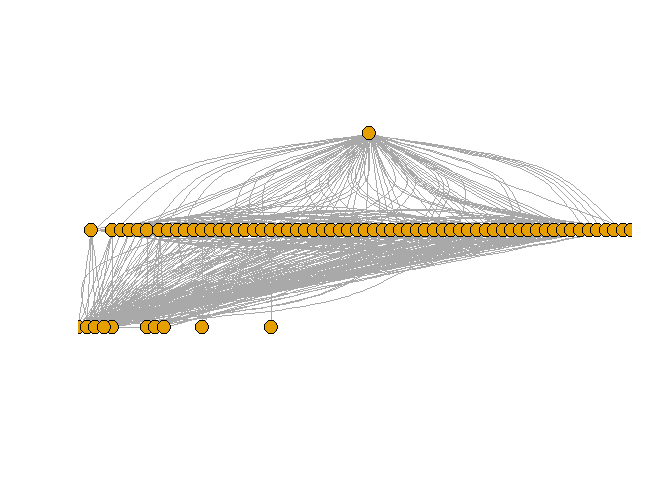
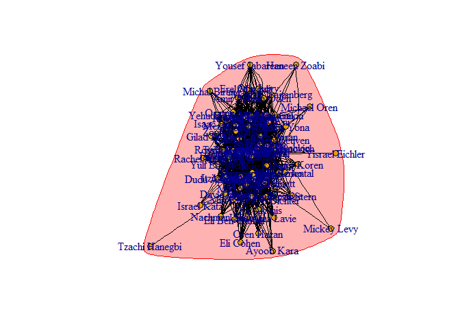

Ex3
================

``` r
setwd("C:\\Users\\Ben\\Documents\\R\\Ex3")
```

### Twitter API

This is R code to get twitter data using their API

``` r
#install.packages("devtools")
#devtools::install_github("mkearney/rtweet")
library(rtweet)
```

    ## Welcome to rtweet v0.4.1!

``` r
appname <- "AppName"
consumerKey <- "myKey"
consumerSecret <- "mySecretKey"
#twitter_token <- create_token(
#    app = appname,
#    consumer_key = consumerKey,
#    consumer_secret = consumerSecret)
mk <- as.data.frame(read.csv("mk_id.csv",colClasses = 'character'))
mk_follow <- NA
j <-0 
for(i in mk$id){
  follows <- get_friends(i,parse = T)
  mk_follow[j+1] <- follows
  j <- j+1
}
```

We used python to get our data here is code: <https://github.com/BenEfrati/ex1/blob/master/network%20analysis/init.py>

The id is the twitter user id of MKs (Members of Knesset) The edges in the graph are friends of each user and the vertices are the MKs.

``` r
library(igraph)
```

    ## 
    ## Attaching package: 'igraph'

    ## The following object is masked from 'package:rtweet':
    ## 
    ##     %>%

    ## The following objects are masked from 'package:stats':
    ## 
    ##     decompose, spectrum

    ## The following object is masked from 'package:base':
    ## 
    ##     union

``` r
md_name <- as.data.frame(read.csv('mk_id.csv',colClasses = 'character'))
data_mk <- as.data.frame(read.csv('friends.csv',colClasses = 'character'))
new <- data_mk
new[] <- md_name$name[match(unlist(data_mk), md_name$id)]
new <- na.omit(new)
twitterg <- graph.data.frame(new, directed = F)
degr.score <- degree(twitterg)
V(twitterg)$size <- degr.score/15
V(twitterg)$name <- ifelse(V(twitterg)$size>10,V(twitterg)$name,NA)
#twitterg$layout <- layout.fruchterman.reingold(twitterg, niter=5000)
igraph.options(plot.layout=layout.graphopt, vertex.size=7)

plot(twitterg, asp=0)
```



``` r
#restore names and sizes
twitterg <- graph.data.frame(new, directed = F)
```

Centrality
----------

### Compute betweenes

``` r
library(igraph)
between <- betweenness(twitterg)
maxBetweenes <- which.max(between)
cat("The actor with the maximum betweenes is:\n")
```

    ## The actor with the maximum betweenes is:

``` r
maxBetweenes
```

    ## Dov Khenin 
    ##         14

### Compute Closeness

``` r
library(igraph)
close <- closeness(twitterg)
maxCloseness <- which.max(close)
cat("The actor with the maximum closeness is:\n")
```

    ## The actor with the maximum closeness is:

``` r
maxCloseness
```

    ## Nava Boker 
    ##         50

### Compute Closeness

``` r
library(igraph)
eigen <- eigen_centrality(twitterg, directed = F)
maxEigen <- which.max(eigen$vector)
cat("The actor with the maximum eigenvector is:\n")
```

    ## The actor with the maximum eigenvector is:

``` r
maxEigen
```

    ## Dov Khenin 
    ##         14

Communities
-----------

### First algorithm

cluster\_edge\_betweenness performs this algorithm by calculating the edge betweenness of the graph, removing the edge with the highest edge betweenness score, then recalculating edge betweenness of the edges and again removing the one with the highest score, etc.

``` r
set.seed(123)
tgc <- cluster_edge_betweenness(twitterg,directed = F)
print("Number of communities:")
```

    ## [1] "Number of communities:"

``` r
print(length(tgc))
```

    ## [1] 1

``` r
print("Size of communities:")
```

    ## [1] "Size of communities:"

``` r
print(sizes(tgc))
```

    ## Community sizes
    ##  1 
    ## 73

``` r
print("Modularity is:")
```

    ## [1] "Modularity is:"

``` r
print(modularity(tgc))
```

    ## [1] 0

``` r
plot(tgc,twitterg)
```

 \#\#\#Second algorithm

``` r
set.seed(123)
tgreedy <- cluster_leading_eigen(twitterg)
print("Number of communities:")
```

    ## [1] "Number of communities:"

``` r
print(length(tgreedy))
```

    ## [1] 2

``` r
print("Size of communities:")
```

    ## [1] "Size of communities:"

``` r
print(sizes(tgreedy))
```

    ## Community sizes
    ##  1  2 
    ## 39 34

``` r
print("Modularity is:")
```

    ## [1] "Modularity is:"

``` r
print(modularity(tgreedy))
```

    ## [1] 0.1003118

``` r
plot(tgreedy,twitterg)
```


